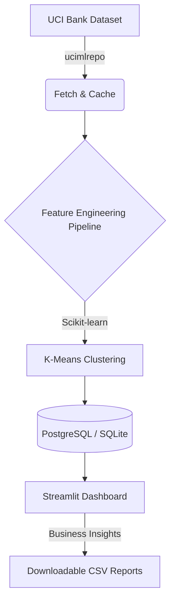

# customer-segmentation-and-insight-generator

An end-to-end, AI-driven customer segmentation application leveraging the **UCI Bank Marketing Dataset**. This project bridges machine learning with business intelligence, demonstrating how to transform raw demographic and behavioral data into actionable marketing segments.

## 🚀 Features

1. **Automated Data Engineering**: Programmatic ingestion of public datasets using `ucimlrepo` with localized caching.
2. **Robust Feature Engineering**: Implements enterprise-grade preprocessing pipelines (imputation, `StandardScaler`, `OneHotEncoder`) built on `scikit-learn`.
3. **Machine Learning (Clustering)**: Uses **K-Means clustering** to identify distinct, statistically significant customer groups (e.g., "High-Value", "At Risk", "Emerging").
4. **Database Integration**: Seamlessly saves analytical results to a PostgreSQL database (with an automated SQLite fallback for rapid local testing) using `SQLAlchemy`.
5. **Business Dashboard**: An interactive, presentation-ready `Streamlit` frontend featuring dynamic `Plotly` visualizations (KPI cards, pie charts, box plots) and a one-click CSV export mechanism for CRM integrations.

---

## 🏗️ Architecture



---

## 🛠️ Tech Stack
- **Data Science**: Python, Pandas, NumPy, Scikit-Learn
- **Database**: PostgreSQL 16, SQLAlchemy
- **UI & Data Viz**: Streamlit, Plotly Express
- **Automation**: Docker Compose, Python Virtual Environments

---

## 🏃 Getting Started

### 1. Prerequisites
Ensure you have Python 3.11+ installed. Optionally, install Docker Desktop to spin up the local PostgreSQL database.

### 2. Installation
Clone the repository and install the dependencies:
```bash
python -m venv .venv
source .venv/bin/activate
pip install -r requirements.txt
```

### 3. Database Setup (Optional)
To use PostgreSQL instead of the default local SQLite database, spin up the Docker container:
```bash
cp .env.example .env
docker compose up -d
```

### 4. Run the Machine Learning Pipeline
This will fetch the dataset (45,000+ rows), preprocess it, train the K-Means algorithm, attach segment names, and push the final data to the database.
```bash
python -m pipeline.run
```

### 5. Launch the Dashboard
Open the interactive Streamlit dashboard to explore the segments:
```bash
streamlit run app/main.py
```

---

## 📈 Example Business Value
This tool allows marketing and product teams to dynamically explore customer cohorts. Instead of targeting all users identically, teams can use the segmented data (exported directly from the UI) to design personalized email campaigns, adjust loan offerings, or target high-risk clients based on their behavioral centroid data.
